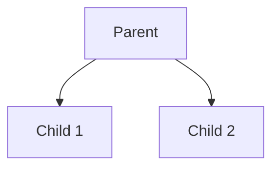

# Logic Programming with Prolog

*Author: Brandon Foley*

## Idea
Logic programming is one of the three core paradigms of programming, alongside imperative and functional approaches. While imperative programming is centered on assignments and state changes, and functional programming emphasizes the application of functions without mutable state, logic programming takes a different perspective. At its core, a logic program consists of a collection of rules and facts, and computation is driven by the process of applying these rules to arrive at conclusions. Rather than specifying how to solve a problem step by step, logic programming focuses on what relationships hold true, allowing the system to infer solutions through logical reasoning.


## Basic Theory

At the center of logic programming there is this idea that computation can be viewed as a process of logical inference. Instead of describing a sequence of operations, as in imperative programming, or composing functions, as in functional programming, a logic program is built from facts and rules that describe relationships. A fact is a basic statement that is always considered true, while a rule expresses a conditional relationship: if certain facts hold, then another fact can be inferred. When you combine these ideas, facts and rules form a knowledge base similar to a database, and running a program means asking questions (or queries) about this knowledge.

The main computational step in logic programming is unification, the process of matching a query with the facts and rules in the program. When a query is issued, the system attempts to unify it with existing facts or the heads of rules. If a match is found, the body of the rule is pursued as a new subproblem. In this way, logical inference proceeds step by step, gradually building towards an answer. Here we can start to introduce an example in database querying. If you had for example a family tree and are searching for the child of a certain parent, it will start at that parent and check each child to see which one is the one that was queried.

One of the most powerful aspects of this logic is its built-in support for backtracking. Since there may be many possible ways to satisfy a query, the system must explore different paths. If one path fails—meaning the inference cannot be completed—the system automatically backtracks to the most recent decision point and tries an alternative. This process continues until either a valid solution is found or all possibilities have been exhausted. Backtracking makes logic programming extremely effective for solving problems that naturally involve search and constraint satisfaction, such as puzzles, planning, or reasoning over complex data. If we go back to our family tree example, say we had a family tree that looks like this:

### Mini Family Tree



Say from parent we wanted to find child 2, in logic programming, it would first look at child 1 and when it checks if that is child 2 and realizes it isnt, it will then go back to parent and try the other option which is correct. In contrast to imperative programming, which requires precise instructions for every step, logic programming is declarative: the programmer specifies what is true, and the system determines how to find the solution.

## The Tool
The tool that I will mainly be focusing on is Prolog, a unique coding language designed for logic programming. Prolog was first created in France in 1972 by Alain Colmerauer and Philippe Roussel, with its name derived from programmation en logique (“programming in logic”). The earliest version was an interpreter built in Fortran by Gerard Battani and Henri Meloni where later, David H. D. Warren brought this work to Edinburgh, where he then developed a new front-end that established the Edinburgh Prolog syntax which is now used for most modern implementations(1).

### Installing The Tool
[download and install](https://www.swi-prolog.org/download/stable) Prolog. On MacOS, after moving SWI-Prolog to the Applications folder, you may have to run `echo 'export PATH="/Applications/SWI-Prolog.app/Contents/MacOS:$PATH"' >> ~/.zshrc` to add `swipl` to your path. Then, running `swipl` in your terminal should start the Prolog interpreter.

## First Example
The eight queens problem is a logic problem in where a user attempts to place all 8 queens on a chess board such that none threaten another.

**What this shows:**
- How Prolog automatically finds solutions through backtracking
- How constraints work together to eliminate impossible choices
- How recursion naturally models complex problems
- The difference between procedural and declarative programming

Create a file named ```eightqueens.pl``` and add the following code:

```prolog
solution(Queens) :- 
    length(Queens, 8),
    queens(Queens).

queens([]).
queens([queen(Row, Col) | Others]) :- 
    queens(Others),
    length(Others, OthersLength),
    Row is OthersLength + 1,
    member(Col, [1,2,3,4,5,6,7,8]),
    noattack(queen(Row, Col), Others).

noattack(_, []).
noattack(queen(Row, Col), [queen(Row1, Col1) | Others]) :-
    Col =\= Col1,                    
    Col1-Col =\= Row1-Row,           
    Col1-Col =\= Row-Row1,
    noattack(queen(Row, Col), Others).
```

Run the program as follows.
```bash
swipl -f eight-queens.pl
```
Then in the Prolog prompt:
```prolog
?- solution(S).
```

Here there are two options either enter `.` to end the program or `;` to see futher possible outputs.

Use Ctrl-d to exit Prolog.

If we enter `trace.` and enter `solution(S).` again. Use the `return` key to look into the execution of a predicate and use `s` to skip directly to the end of the execution of a predicate. Enter `a` to abort the execution. That is useful when you got lost in the execution and want to start over again.

## Intro Examples
In logic programming, a Prolog database is composed of facts and rules that describe relationships between entities in a declarative way. Rather than specifying how to compute something, the programmer defines what is true about the problem domain. This allows Prolog to act as a powerful tool for database querying, where relationships can be inferred rather than explicitly stored. Queries are made by posing logical questions to the database then uses backtracking to search through known facts and rules to find all possible solutions to the query.

In a simple family database, the database models a small family tree using facts such as `parent(arthur, george)` and `parent(george, amelia)`, which record direct parent-child relationships. Rules like `grandparent/2`, `sibling/2`, and `ancestor/2` define how more complex family relationships can be logically derived. For instance, `grandparent(X, Z) :- parent(X, Y)`, `parent(Y, Z)` states that X is a grandparent of Z if X is a parent of Y and Y is a parent of Z. The sibling rule ensures that two people are considered siblings if they share a parent but are not the same person. The gender facts, combined with the `father/2` and `mother/2` rules, extends the database by categorizing parents according to gender, allowing for more natural queries like `father(X, Y)` or `mother(X, Y)`.

When a query such as

`?- grandparent(X, richard).`


is executed, Prolog searches through the database to find all individuals X who satisfy the condition of being a grandparent of richard. The trace output reveals Prolog’s reasoning process step by step:

```
   Call: (12) grandparent(_32210, richard) ? creep
   Call: (13) parent(_32210, _33508) ? creep
   Exit: (13) parent(arthur, george) ? creep
   Call: (13) parent(george, richard) ? creep
   Exit: (13) parent(george, richard) ? creep
   Exit: (12) grandparent(arthur, richard) ? creep
X = arthur ;
   Redo: (13) parent(george, richard) ? creep
   Fail: (13) parent(george, richard) ? creep
   Redo: (13) parent(_32210, _33508) ? creep
   Exit: (13) parent(harriet, george) ? creep
   Call: (13) parent(george, richard) ? creep
   Exit: (13) parent(george, richard) ? creep
   Exit: (12) grandparent(harriet, richard) ? creep
X = harriet ;
```

Here, Prolog begins by attempting to satisfy the rule for `grandparent/2`. It first matches `parent(_32210, _33508)` and discovers that arthur is a parent of george. Then it checks whether george is a parent of richard, which succeeds. As a result, Prolog concludes that arthur is indeed a grandparent of richard. It then continues to find the other grandparent to see if they are present which is found to be harriet. The [trace] output exposes the resolution process, where Prolog recursively attempts and verifies subgoals until a consistent solution is found. If we were to continue with this trace it would search the rest of the database to see if any other combinations would lead to the `grandparent/2` fact being true and when it fails it will just have the two grandparents that are present, arthur and harriet.

### Basic Arithmetic

While Prolog is primarily a symbolic reasoning language, it also supports arithmetic operations and numerical comparisons. Unlike traditional imperative languages where expressions are directly evaluated, Prolog treats arithmetic as part of its logical inference system. Computation occurs through the evaluation operator `is`, which forces the right-hand expression to be evaluated numerically before comparison or assignment.

For example here are some simple relationships between numbers:

```prolog
% ---------- Arithmetic Facts and Rules ----------

% The square of a number
square(X, Y) :- Y is X * X.

% The sum of two numbers
sum(A, B, Result) :- Result is A + B.

% The average of two numbers
average(A, B, Avg) :- Avg is (A + B) / 2.

% Check if one number is greater than another
greater_than(A, B) :- A > B.

```

In this example, Prolog uses the `is` operator to evaluate arithmetic expressions. The left-hand side (like `Y or Result`) becomes bound to the numeric result of the right-hand expression. Arithmetic comparisons such as `>, <, >=, and =<` can then be used within rules to reason about numerical relationships.

You can also do this directly within the terminal of swi-prolog. for example:

```prolog
?- Y is 3 +5.
Y = 8.

?- Y is 5*8.
Y = 40.

?- Y is 10/2.
Y = 5.
```

You could also using our example from above run querys like these:

```prolog
?- square(4, Y).
Y = 16.

?- sum(5, 7, R).
R = 12.

?- average(10, 20, A).
A = 15.0.

?- greater_than(8, 5).
true.
```
What's interesting is that prolog doesn’t "calculate" in the way procedural languages do, it evaluates logical truths involving numeric expressions. When you ask ?- square(4, Y)., Prolog checks if there exists a value of Y such that Y is 4 * 4 can be satisfied. Once the arithmetic succeeds, it binds Y to the result 16.


## References
1. https://swish.swi-prolog.org/p/dselman.swinb
2. https://www.geeksforgeeks.org/dsa/8-queen-problem/
3. https://www.swi-prolog.org/pldoc/man?section=arith