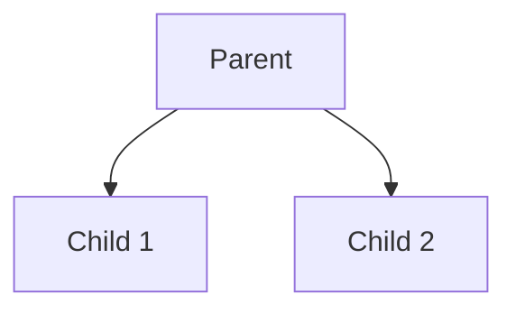

# Logic Programming with Prolog

*Author: Brandon Foley*

## Idea
Logic programming is one of the three core paradigms of programming, alongside imperative and functional approaches. While imperative programming is centered on assignments and state changes, and functional programming emphasizes the application of functions without mutable state, logic programming takes a different perspective. At its core, a logic program consists of a collection of rules and facts, and computation is driven by the process of applying these rules to arrive at conclusions. Rather than specifying how to solve a problem step by step, logic programming focuses on what relationships hold true, allowing the system to infer solutions through logical reasoning.

## Basic Theory

At the center of logic programming there is this idea that computation can be viewed as a process of logical inference. Instead of describing a sequence of operations, as in imperative programming, or composing functions, as in functional programming, a logic program is built from facts and rules that describe relationships. A fact is a basic statement that is always considered true, while a rule expresses a conditional relationship: if certain facts hold, then another fact can be inferred. When you combine these ideas, facts and rules form a knowledge base similar to a database, and running a program means asking questions (or queries) about this knowledge.

The main computational step in logic programming is unification, the process of matching a query with the facts and rules in the program. When a query is issued, the system attempts to unify it with existing facts or the heads of rules. If a match is found, the body of the rule is pursued as a new subproblem. In this way, logical inference proceeds step by step, gradually building towards an answer. Here we can start to introduce an example in database querying. If you had for example a family tree and are searching for the child of a certain parent, it will start at that parent and check each child to see which one is the one that was queried.

One of the most powerful aspects of this logic is its built-in support for backtracking. Since there may be many possible ways to satisfy a query, the system must explore different paths. If one path fails—meaning the inference cannot be completed—the system automatically backtracks to the most recent decision point and tries an alternative. This process continues until either a valid solution is found or all possibilities have been exhausted. Backtracking makes logic programming extremely effective for solving problems that naturally involve search and constraint satisfaction, such as puzzles, planning, or reasoning over complex data. If we go back to our family tree example, say we had a family tree that looks like this:

### Mini Family Tree

Say from parent we wanted to find child 2, in logic programming, it would first look at child 1 and when it checks if that is child 2 and realizes it isnt, it will then go back to parent and try the other option which is correct. In contrast to imperative programming, which requires precise instructions for every step, logic programming is declarative: the programmer specifies what is true, and the system determines how to find the solution.

## The Tool
The tool that I will mainly be focusing on is Prolog, a unique coding language designed for logic programming. Prolog was first created in France in 1972 by Alain Colmerauer and Philippe Roussel, with its name derived from programmation en logique (“programming in logic”). The earliest version was an interpreter built in Fortran by Gerard Battani and Henri Meloni where later, David H. D. Warren brought this work to Edinburgh, where he then developed a new front-end that established the Edinburgh Prolog syntax which is now used for most modern implementations(1).

### Installing The Tool

## References
1. https://swish.swi-prolog.org/p/dselman.swinb 