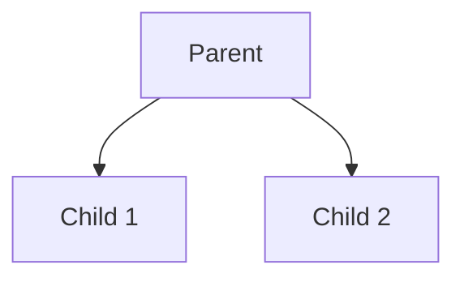

# Logic Programming with Prolog

*Author: Brandon Foley*

## Idea
Logic programming is one of the three core paradigms of programming, alongside imperative and functional approaches. While imperative programming is centered on assignments and state changes, and functional programming emphasizes the application of functions without mutable state, logic programming takes a different perspective. At its core, a logic program consists of a collection of rules and facts, and computation is driven by the process of applying these rules to arrive at conclusions. Rather than specifying how to solve a problem step by step, logic programming focuses on what relationships hold true, allowing the system to infer solutions through logical reasoning.


## Basic Theory

At the center of logic programming there is this idea that computation can be viewed as a process of logical inference. Instead of describing a sequence of operations, as in imperative programming, or composing functions, as in functional programming, a logic program is built from facts and rules that describe relationships. A fact is a basic statement that is always considered true, while a rule expresses a conditional relationship: if certain facts hold, then another fact can be inferred. When you combine these ideas, facts and rules form a knowledge base similar to a database, and running a program means asking questions (or queries) about this knowledge.

The main computational step in logic programming is unification, the process of matching a query with the facts and rules in the program. When a query is issued, the system attempts to unify it with existing facts or the heads of rules. If a match is found, the body of the rule is pursued as a new subproblem. In this way, logical inference proceeds step by step, gradually building towards an answer. Here we can start to introduce an example in database querying. If you had for example a family tree and are searching for the child of a certain parent, it will start at that parent and check each child to see which one is the one that was queried.

One of the most powerful aspects of this logic is its built-in support for backtracking. Since there may be many possible ways to satisfy a query, the system must explore different paths. If one path fails—meaning the inference cannot be completed—the system automatically backtracks to the most recent decision point and tries an alternative. This process continues until either a valid solution is found or all possibilities have been exhausted. Backtracking makes logic programming extremely effective for solving problems that naturally involve search and constraint satisfaction, such as puzzles, planning, or reasoning over complex data. If we go back to our family tree example, say we had a family tree that looks like this:

### Mini Family Tree



Say from parent we wanted to find child 2, in logic programming, it would first look at child 1 and when it checks if that is child 2 and realizes it isnt, it will then go back to parent and try the other option which is correct. In contrast to imperative programming, which requires precise instructions for every step, logic programming is declarative: the programmer specifies what is true, and the system determines how to find the solution.

## The Tool
The tool that I will mainly be focusing on is Prolog, a unique coding language designed for logic programming. Prolog was first created in France in 1972 by Alain Colmerauer and Philippe Roussel, with its name derived from programmation en logique (“programming in logic”). The earliest version was an interpreter built in Fortran by Gerard Battani and Henri Meloni where later, David H. D. Warren brought this work to Edinburgh, where he then developed a new front-end that established the Edinburgh Prolog syntax which is now used for most modern implementations(1).

### Installing The Tool
[download and install](https://www.swi-prolog.org/download/stable) Prolog. On MacOS, after moving SWI-Prolog to the Applications folder, you may have to run `echo 'export PATH="/Applications/SWI-Prolog.app/Contents/MacOS:$PATH"' >> ~/.zshrc` to add `swipl` to your path. Then, running `swipl` in your terminal should start the Prolog interpreter.

## First Example
The eight queens problem is a logic problem in where a user attempts to place all 8 queens on a chess board such that none threaten another.

**What this shows:**
- How Prolog automatically finds solutions through backtracking
- How constraints work together to eliminate impossible choices
- How recursion naturally models complex problems
- The difference between procedural and declarative programming

Create a file named ```eightqueens.pl``` and add the following code:

```prolog
solution(Queens) :- 
    length(Queens, 8),
    queens(Queens).

queens([]).
queens([queen(Row, Col) | Others]) :- 
    queens(Others),
    length(Others, OthersLength),
    Row is OthersLength + 1,
    member(Col, [1,2,3,4,5,6,7,8]),
    noattack(queen(Row, Col), Others).

noattack(_, []).
noattack(queen(Row, Col), [queen(Row1, Col1) | Others]) :-
    Col =\= Col1,                    
    Col1-Col =\= Row1-Row,           
    Col1-Col =\= Row-Row1,
    noattack(queen(Row, Col), Others).
```

Run the program as follows.
```bash
swipl -f eight-queens.pl
```
Then in the Prolog prompt:
```prolog
?- solution(S).
```

Here there are two options either enter `.` to end the program or `;` to see futher possible outputs.

Use Ctrl-d to exit Prolog.

If we enter `trace.` and enter `solution(S).` again. Use the `return` key to look into the execution of a predicate and use `s` to skip directly to the end of the execution of a predicate. Enter `a` to abort the execution. That is useful when you got lost in the execution and want to start over again.

## Intro Examples
In logic programming, a Prolog database is composed of facts and rules that describe relationships between entities in a declarative way. Rather than specifying how to compute something, the programmer defines what is true about the problem domain. This allows Prolog to act as a powerful tool for database querying, where relationships can be inferred rather than explicitly stored. Queries are made by posing logical questions to the database then uses backtracking to search through known facts and rules to find all possible solutions to the query.

In a simple family database, the database models a small family tree using facts such as `parent(arthur, george)` and `parent(george, amelia)`, which record direct parent-child relationships. Rules like `grandparent/2`, `sibling/2`, and `ancestor/2` define how more complex family relationships can be logically derived. For instance, `grandparent(X, Z) :- parent(X, Y)`, `parent(Y, Z)` states that X is a grandparent of Z if X is a parent of Y and Y is a parent of Z. The sibling rule ensures that two people are considered siblings if they share a parent but are not the same person. The gender facts, combined with the `father/2` and `mother/2` rules, extends the database by categorizing parents according to gender, allowing for more natural queries like `father(X, Y)` or `mother(X, Y)`.

When a query such as

`?- grandparent(X, richard).`


is executed, Prolog searches through the database to find all individuals X who satisfy the condition of being a grandparent of richard. The trace output reveals Prolog’s reasoning process step by step:

```
   Call: (12) grandparent(_32210, richard) ? creep
   Call: (13) parent(_32210, _33508) ? creep
   Exit: (13) parent(arthur, george) ? creep
   Call: (13) parent(george, richard) ? creep
   Exit: (13) parent(george, richard) ? creep
   Exit: (12) grandparent(arthur, richard) ? creep
X = arthur ;
   Redo: (13) parent(george, richard) ? creep
   Fail: (13) parent(george, richard) ? creep
   Redo: (13) parent(_32210, _33508) ? creep
   Exit: (13) parent(harriet, george) ? creep
   Call: (13) parent(george, richard) ? creep
   Exit: (13) parent(george, richard) ? creep
   Exit: (12) grandparent(harriet, richard) ? creep
X = harriet ;
```

Here, Prolog begins by attempting to satisfy the rule for `grandparent/2`. It first matches `parent(_32210, _33508)` and discovers that arthur is a parent of george. Then it checks whether george is a parent of richard, which succeeds. As a result, Prolog concludes that arthur is indeed a grandparent of richard. It then continues to find the other grandparent to see if they are present which is found to be harriet. The [trace] output exposes the resolution process, where Prolog recursively attempts and verifies subgoals until a consistent solution is found. If we were to continue with this trace it would search the rest of the database to see if any other combinations would lead to the `grandparent/2` fact being true and when it fails it will just have the two grandparents that are present, arthur and harriet.

### Basic Arithmetic

While Prolog is primarily a symbolic reasoning language, it also supports arithmetic operations and numerical comparisons. Unlike traditional imperative languages where expressions are directly evaluated, Prolog treats arithmetic as part of its logical inference system. Computation occurs through the evaluation operator `is`, which forces the right-hand expression to be evaluated numerically before comparison or assignment.

For example here are some simple relationships between numbers:

```prolog
% ---------- Arithmetic Facts and Rules ----------

% The square of a number
square(X, Y) :- Y is X * X.

% The sum of two numbers
sum(A, B, Result) :- Result is A + B.

% The average of two numbers
average(A, B, Avg) :- Avg is (A + B) / 2.

% Check if one number is greater than another
greater_than(A, B) :- A > B.

```

In this example, Prolog uses the `is` operator to evaluate arithmetic expressions. The left-hand side (like `Y or Result`) becomes bound to the numeric result of the right-hand expression. Arithmetic comparisons such as `>, <, >=, and =<` can then be used within rules to reason about numerical relationships.

You can also do this directly within the terminal of swi-prolog. for example:

```prolog
?- Y is 3 +5.
Y = 8.

?- Y is 5*8.
Y = 40.

?- Y is 10/2.
Y = 5.
```

You could also using our example from above run querys like these:

```prolog
?- square(4, Y).
Y = 16.

?- sum(5, 7, R).
R = 12.

?- average(10, 20, A).
A = 15.0.

?- greater_than(8, 5).
true.
```
What's interesting is that prolog doesn’t "calculate" in the way procedural languages do, it evaluates logical truths involving numeric expressions. When you ask ?- square(4, Y)., Prolog checks if there exists a value of Y such that Y is 4 * 4 can be satisfied. Once the arithmetic succeeds, it binds Y to the result 16.

## The Landscape Of Tools

Prolog has been implemented in many different environments since its introduction in the 1970s, each designed with particular goals such as speed, interoperability, constraint solving, or educational use. Although the examples throughout this book are written using SWI-Prolog, one of the most popular and accessible implementations, it is worth going through and understanding the broader ecosystem of tools that have shaped the Prolog landscape.

**SICStus Prolog** is a commercial-grade Prolog system developed at the Swedish Institute of Computer Science. Known for its robustness and performance, SICStus has been widely adopted in industrial and research environments where reliability is essential. It supports advanced features such as constraint logic programming (CLP), efficient memory management, and an extensive set of libraries for interfacing with external systems. Its stability and compliance with ISO Prolog standards make it a favorite for large-scale applications in AI, natural language processing, and expert systems.

**GNU Prolog** takes a different approach, functioning as a native-code compiler rather than an interpreter. It compiles Prolog code directly into machine code via an intermediate C representation. This results in highly efficient executables compared to SICStus. GNU Prolog also includes a finite domain constraint solver and provides a C interface, allowing integration with low-level systems programming. Its minimalist design and speed make it ideal for embedding Prolog logic in performance-sensitive applications.

**ECLiPSe (ECRC Logic Programming System)** extends traditional Prolog into the field of constraint logic programming (CLP). It supports solving complex combinatorial problems by allowing constraints over integers, reals, sets, and other structures to be expressed directly in logic. ECLiPSe is  strongest in operations research, scheduling, and optimization problems, offering a flexible environment for hybrid programming that blends declarative and procedural paradigms.

Across these systems, the one unifying theme is Prolog’s declarative nature. Each tool preserves the language’s logical foundation while extending it for different domains and computational models. Whether one prioritizes performance, integration, or constraint solving, there exists a Prolog implementation suited to the task.

I want to put an empahsis on **Datalog**, while derived from Prolog, represents a specialized subset of logic programming optimized for database querying and deductive reasoning. Unlike Prolog, Datalog omits complex features such as function symbols and unrestricted recursion, making it declarative, decidable, and well-suited for large-scale data processing.

Modern Datalog systems, such as **Soufflé** and **LogicBlox**, compile logical rules into efficient relational operations, bridging the gap between logic programming and database optimization. Soufflé, for example, is widely used in static program analysis, translating high-level Datalog specifications into optimized C++ code. Similarly, LogicBlox extends Datalog with constraints and aggregates, powering enterprise analytics and reasoning over massive datasets.

In essence, Datalog emphasizes the data-centric dimension of logic programming. While traditional Prolog excels in symbolic AI and dynamic reasoning, Datalog’s strength lies in query optimization, parallel execution, and scalability, making it a core technology in both academic research and industrial data systems.

## Algorithms

In a logic-programming environment like SWI-Prolog, “algorithms” often looks different than in imperative languages. You don’t typically write loops or mutable state; instead you use recursion, backtracking, higher-order predicates, and built-in primitives. However, you can implement many classic algorithmic patterns (sorting, searching, aggregation, constraint-solving, graph search, etc.), or rely on libraries that provide optimized primitives. This section surveys both built-in support and user-level techniques you might use when building “algorithms” in SWI-Prolog.

### Built-in / Library-Based Algorithms

SWI-Prolog includes many libraries that are algorithmic in nature. A few examples are:

* Sorting / Searching
    - SWI-Prolog supports `sort/2` and `keysort/2` for sorting lists or pairs. These are often more efficient than hand-rolled sorts, and you can build on them with `maplist/3`, `foldl/4`, or other higher-order predicates.
* Constraint Logic Programming / Optimization Libraries
    - Prolog supports constraint-based solving via libraries such as CLP(B), CLP(FD), and simplex.
    For example, SWI-Prolog provides a library(simplex) that lets you solve linear programming problems.
* Engines & Aggregation
    - SWI-Prolog includes support for engines (coroutines or goal-engines) that allow you to decouple backtracking enumeration of solutions from accumulation/aggregation logic.

Now these are some prebuilt in functions that users can use for various problems. However there are almost certainly cases where there are algorithms you need that are not already implemented. So what are some samples of algorithms that you would implement yourslef?

### User-Level Algorithms

* List Recursion & Accumulators
    - Many algorithms on lists (sum, maximum, mapping, flatten, filter, reverse) are best written using recursion with accumulator variables to avoid building work after recursive calls (i.e. tail-recursive style). Example:
    ```prolog
    sum_list([], 0).
    sum_list([H|T], Sum) :-
        sum_list(T, SumTail),
        Sum is H + SumTail.
    ```
    Or tail-recursive version:

    ```prolog
    sum_list_acc(List, Sum) :-
        sum_list_acc(List, 0, Sum).

    sum_list_acc([], Acc, Acc).
    sum_list_acc([H|T], Acc0, Sum) :-
        Acc1 is Acc0 + H,
        sum_list_acc(T, Acc1, Sum).
    ```
* Sorting Algorithms
    - For a quick example, quicksort can be written with list partitioning and recursion:
    ```prolog
    quicksort([], []).
    quicksort([Pivot|Rest], Sorted) :-
        partition(Rest, Pivot, Less, Greater),
        quicksort(Less, SortedLess),
        quicksort(Greater, SortedGreater),
        append(SortedLess, [Pivot|SortedGreater], Sorted).
    ```
    While this is less efficent than the built in `sort/2` its always good to know what other resources and capabilites are available

* Graph Traversal / Search
    - You can implement depth-first search (DFS), breadth-first search (BFS), or state-space search in Prolog. That often means defining your graph as `edge(Node, Neighbor)` facts, then writing recursive predicates that carry visited-node accumulators, path reconstruction, cycle detection, etc.

* Constraint / Optimization via Recursion & CLP(FD)
    - Suppose you want to solve a combinatorial problem (e.g. N-Queens, magic squares, scheduling) like we did in our first problem. You can combine recursion with constraints (domain variables) using libraries like clpfd.

* Meta-Programming / Higher-Order Patterns
    - You can write predicates that take other goals as parameters (using `call/1`, `maplist/2-3`, etc.), or write interpreters at runtime. This is useful if your algorithm must generate or test dynamic goals or constraints.

## Benchmarks & Competitions in Logic / Formal Methods

Benchmarks and competitions play a major role in driving progress in formal methods, logic programming, automated reasoning, program verification, and related areas. They help by:

- Providing standardized problem sets for comparing systems
- Pushing tool builders to optimize for realistic workloads
- Raising visibility and credibility for research / tool-development
- Encouraging reproducibility (since benchmarks are shared)
- Motivating novel techniques to "win" or improve scores

Below are some of the benchmarks / competitions that I found that are relevant to logic programming, Prolog-like systems, or the broader formal methods / automated reasoning world. Some are directly applicable to Prolog or logic-programming; others are less related, but suggest opportunities for Prolog / CLP / logic-based tooling to participate or be compared.

### Prolog / Logic Programming Benchmarks

These are competitions / benchmark suites that more directly touch Prolog or logic-programming implementations.

| Name | Description & Relevance |
|------|------------------------|
| **SWI-Prolog benchmark suite** | SWI-Prolog hosts a benchmark set (originating from the "van Roy" benchmarks) in its repository. It supports running multiple systems (SWI, YAP, SICStus, etc.) via its compare driver. [GitHub](https://github.com/SWI-Prolog/bench) |
| **Logtalk benchmark suite** | According to StackOverflow discussions, there is a classical set of Prolog benchmarks included in Logtalk. These can be used to compare Prolog backends via Logtalk wrapper. [Logtalk](https://logtalk.org/) |
| **CMU AI Repository — Prolog benchmark code** | There is an older collection at CMU's AI Repository under lang/prolog/code/bench/ that includes standard small programs (8-queens, list reversal, cryptarithm benchmarks etc.) [CMU School of Computer Science](https://www.cs.cmu.edu/) |
| **Mercury benchmarks** | Although Mercury is a logic / functional-logic language rather than pure Prolog, its benchmark suite includes examples convertible to Prolog style. These benchmarks are used to compare Mercury against Prolog implementations too. [MercuryLang](https://mercurylang.org/) |

These benchmarks tend to focus on execution-speed, memory use, or scalability of inference/unification/backtracking on small-to-medium sized logic / search programs.

### Competitions & Broader Formal Methods Benchmarking

While not always Prolog-specific, these competitions shape the formal methods / logic-based reasoning tools' landscape. They offer model languages, standardized input formats, benchmark suites, and evaluation metrics. They may present opportunities for Prolog-based tools (e.g. CLP, logic-programming-as-backend) to compete or be compared.

| Competition / Benchmark | Summary & Relevance |
|------------------------|---------------------|
| **SV-COMP** (Software Verification Competition) | A major international competition for software verification tools. It provides a large benchmark repository, standardized formats, and yearly contest editions. Though not Prolog per se, aspects such as verifying safety / correctness properties might be implemented using logic-based reasoning or Prolog-driven model checkers. [SV-COMP](https://sv-comp.sosy-lab.org/) |
| **CADE ATP / CASC** (Automated Theorem Proving Competition) | Annual competition for first-order logic theorem provers. Prolog may play a role in the proof engine / back-end for logic-based provers. [Wikipedia](https://en.wikipedia.org/wiki/CADE_ATP_System_Competition) |
| **Answer Set Programming (ASP) Competition** | ASP is closely related to logic programming; its competitions compare ASP solvers using benchmark suites. [arXiv](https://arxiv.org/) |
| **RuleML Symposium — International Rule Challenge** | RuleML organizes an "International Rule Challenge" associated with rule-based systems & reasoning engines. [Wikipedia](https://en.wikipedia.org/wiki/RuleML) |
| **POPLmark challenge** | More on the mechanized metatheory side (proofs about programming language semantics), but significant as an example of benchmarking / standardizing challenges in formal methods. [Wikipedia](https://en.wikipedia.org/wiki/POPLmark) |
| **Various verification / model checking competitions** | There are many others in the formal methods / model checking space (e.g. reactive synthesis competitions, termination / SMT-Solver benchmarks).

These competitions often expect tools to support specific input / output formats, provide standard measures (time, memory, correctness), and sometimes require strict conformance or reproducibility.

## Industrial Applications of Logic Programming


Logic programming and its Datalog relatives have had concrete, high-impact uses in industry — from static program analysis to enterprise decision systems — and they are now interacting with generative (neural) methods in ways that are reshaping research and tooling.

---

### Key Industrial Applications

| Area | Why it Mattered | Representative Tools / Projects |
|------|-----------------|--------------------------------|
| **Static Program Analysis & Security** | Datalog enabled concise, portable specifications of whole-program analyses; compiled Datalog engines scale analyses to very large codebases. | Soufflé, DOOP <br> [Soufflé](https://souffle-lang.github.io/) |
| **Declarative Enterprise Analytics** | Logic/Datalog variants provided a unified, declarative backend for analytics + transactional logic, changing how complex business rules are expressed and maintained. | LogicBlox / LogiQL <br> [Department of Computer Science](https://www.cs.cmu.edu/) |
| **Immutable Fact Stores & Auditability** | Datom-style immutable facts let systems expose verifiable histories and temporal queries, useful in finance and audit-focused systems. | Datomic <br> [Datomic](https://www.datomic.com/) |
| **Program-analysis Portability & Reproducibility** | Datalog specifications made analyses portable between engines, improving reproducibility and enabling rapid experiment/production cycles. | DOOP → Soufflé porting studies <br> [PLDI 2017](https://pldi17.sigplan.org/) |

---

### How Generative AI is Changing Formal Methods

Recent years have seen rapid integration of neural/generative methods with formal, symbolic tools:

- **Large language models and neural theorem provers** are being used to propose proof steps, rank candidate proof actions, and generate tactics that formal provers can check
- **Reduced manual effort** and exploration of new hybrid workflows
- **Surveys and recent systems** report improved automation and higher proof rates when neural guidance is combined with traditional provers
- **Neural→symbolic loop** is a major current research direction

**Key Resources:**
- [SciSpace Survey](https://typeset.io) on deep learning for theorem proving

---

### Why These Applications Influenced the Field

Scalability + Abstraction
Datalog's declarative nature made it easier to express large analyses; high-quality engines (Soufflé, LogicBlox) made those analyses fast and deployable, changing where and how researchers built static analyzers.

[Soufflé Project](https://souffle-lang.github.io/)

Reproducibility & Portability
Porting DOOP to Soufflé demonstrated that large, real-world analyses can be expressed in compact rule sets and moved between engines — a pragmatic win for reproducible research.

[PLDI 2017 - Porting Doop to Soufflé](https://pldi17.sigplan.org/)

Neural+Symbolic Synergy
Generative models lower the barrier to producing candidate proofs or tactics; symbolic provers provide rigorous checking. Together they increase automation while maintaining correctness guarantees — a potent combination for verification and formalization workflows.

[SciSpace Research](https://typeset.io)

---


## References
1. https://swish.swi-prolog.org/p/dselman.swinb
2. https://www.geeksforgeeks.org/dsa/8-queen-problem/
3. https://www.swi-prolog.org/pldoc/man?section=arith
4. https://sicstus.sics.se/    #SICStus Prolog
5. https://www.researchgate.net/publication/47822182_SICStus_Prolog_--_the_first_25_years
6. http://www.gprolog.org/     #GNU Prolog
7. https://eclipseclp.org/     #Eclipse
8. https://www.metalevel.at/prolog/sorting
9. https://courses.cs.washington.edu/courses/cse341/12au/prolog/basics.html
10. https://blogit.michelin.io/an-introduction-to-datalog/