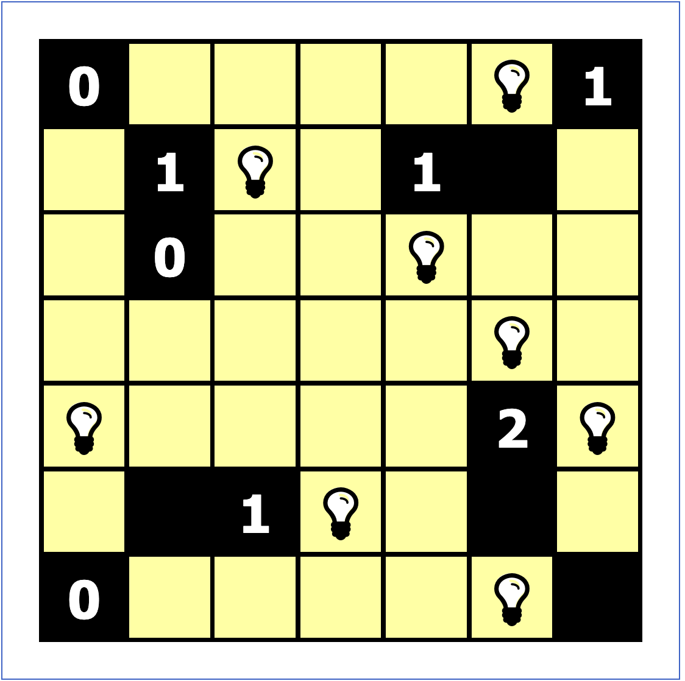

# Minizinc Examples

This folder collects examples of minizinc programs.

## Akari

CLI command to run:
`minizinc --solver org.minizinc.mip.coin-bc akari/akari.mzn akari/akari_7x7.dzn `

akari.mzn reads from a *.dzn file and then solves the puzzle, outputing a grid:

```
0 * * * * L 1
* 1 L * 1 B *
* 0 * * L * *
* * * * * L *
L * * * * 2 L
* B 1 L * B *
0 * * * * L B
```

where L represents a lamp, B represents a solid black block, a number represents a numbered black block with the respective number of adjancent lamps, and * represents a block that is "lit up".

<!-- 

{width=300} | {width=300} |